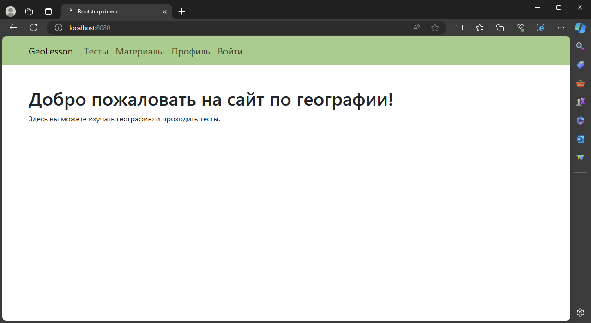
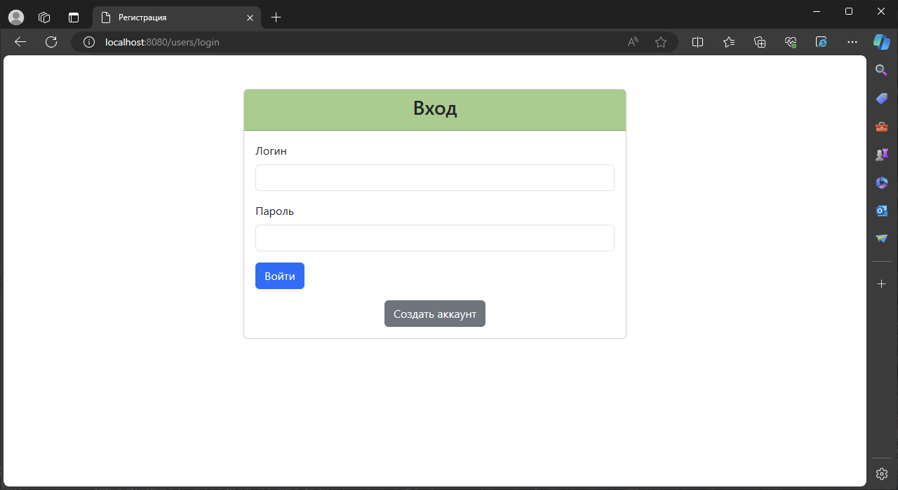
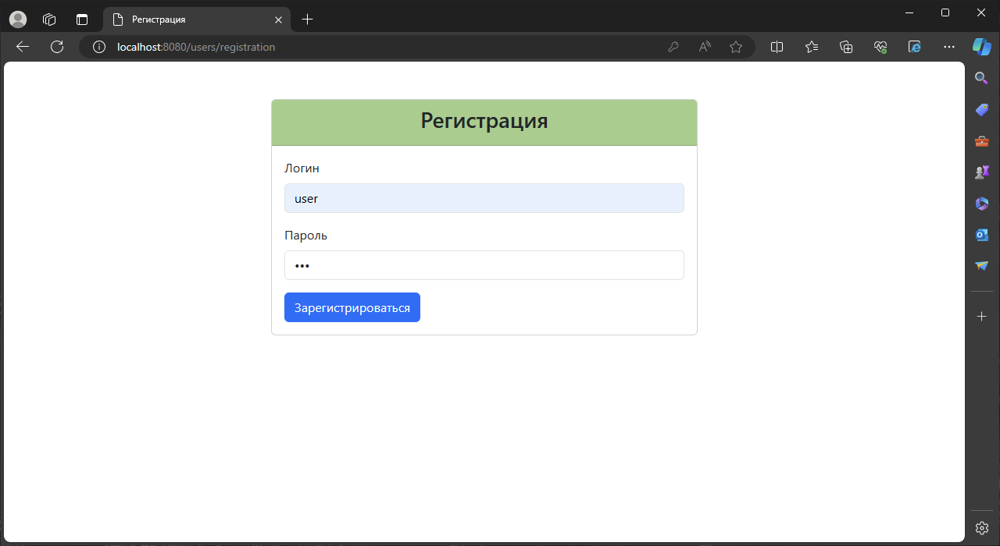
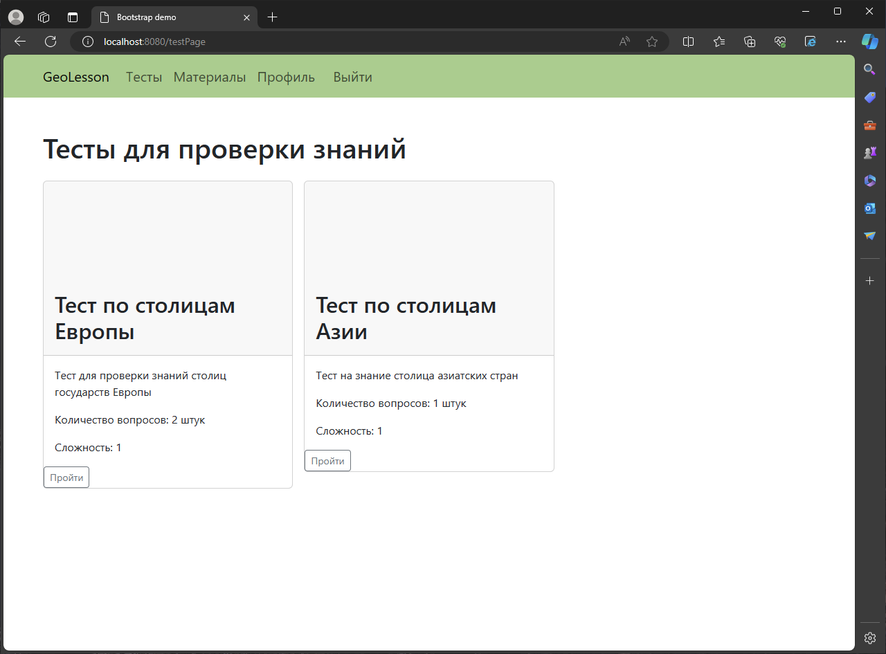
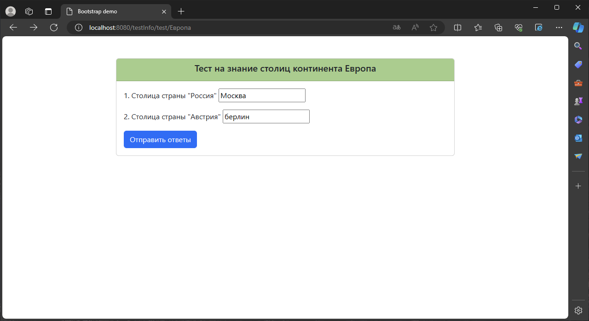
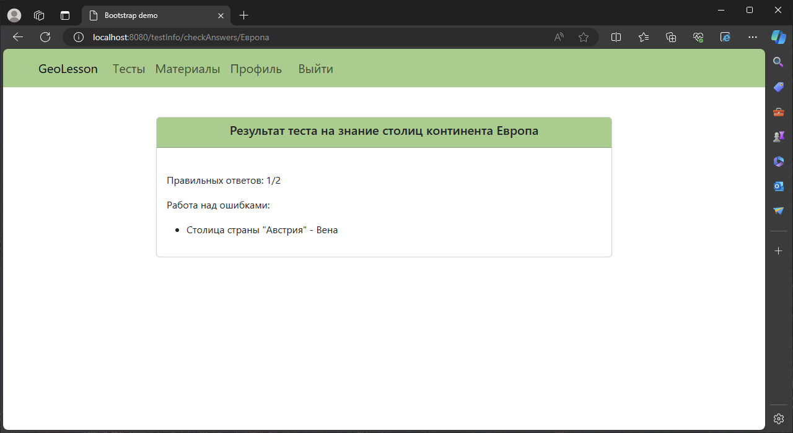
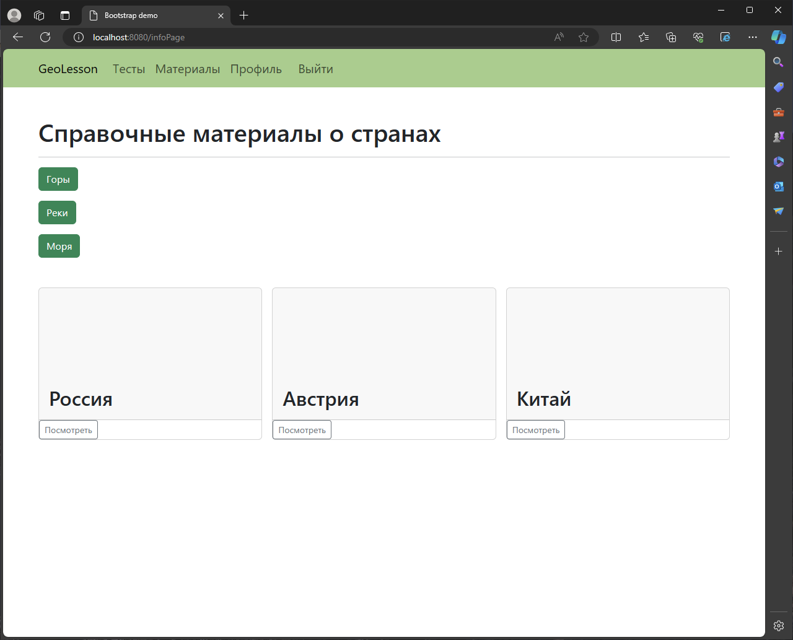
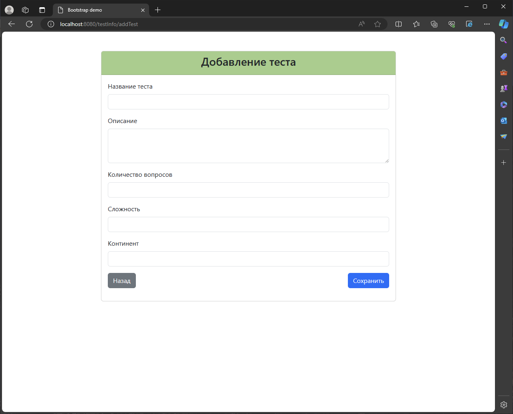
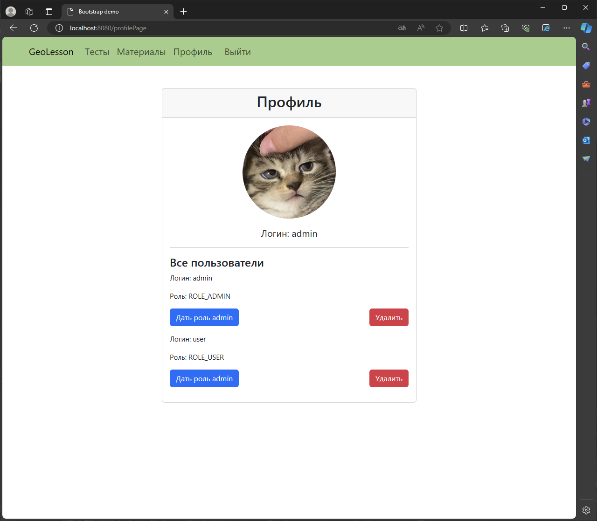

# Веб-приложение для изучения географии и самоконтроля
## Евсюков Александр </br> Группа БПИ224

### Набор требований к проекту:
* `Java` версии 21
* `Gradle` версии 8.2
* `Spring Boot` версии 3.2.3

### Инструкция по запуску:
1. Склонируйте репозиторий с помощью команды `git clone`
2. Откройте проект в `IntelliJ IDEA`
3. Соберите проект с помощью команды 
```./gradlew bootRun```
4. Запустите проект в Docker-контейнере с помощью команды 
```docker-compose up --build```

### Пример работы программы:








